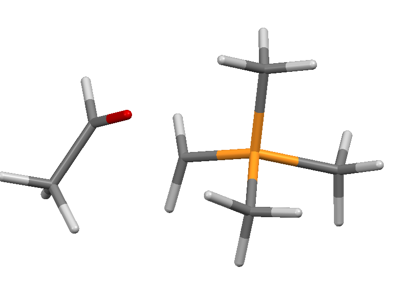
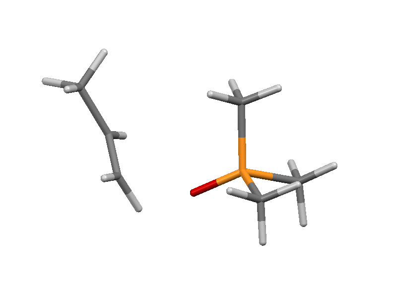
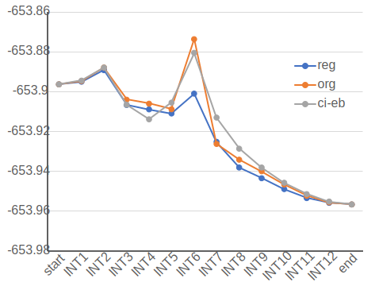
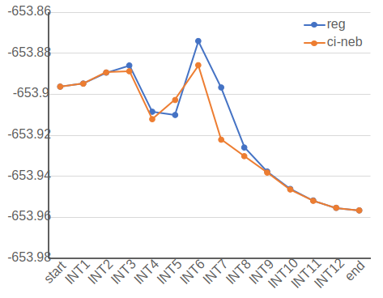
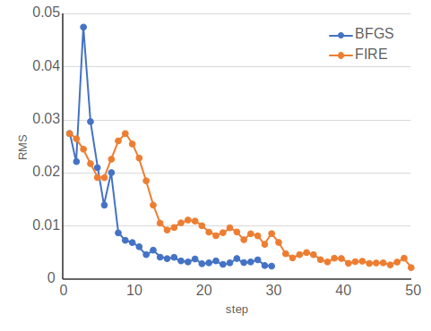
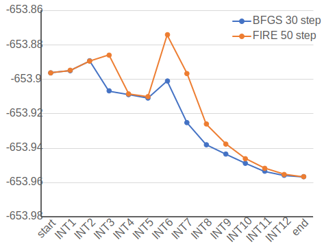

# Exmaple: Wittig Reaction
書き途中
## 始点と終点の構造
左：始点，右:終点の構造  

## ３つのNEB法の比較
30 step計算後のpathについてエネルギーの比較  
すべてBFGS法にて最適化   
  

## Regular-NEBとCI-NEBの比較 
FIRE法にて最適化  
30 step計算後のpathについてエネルギーの比較  
  

## BFGS法とFIRE法による最適化の比較
どちらもregular-NEBで計算  
  
30 step(BFGS)，50 step(FIRE)計算後のpathについてエネルギーの比較  
  